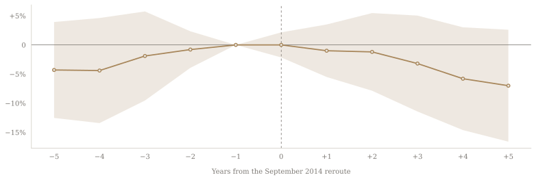

# Oliver Hatley

::: {.tagline}
Data analysis · Mobile & Birmingham, AL
:::
------------------------------------------------------------------------

::: {.hero-chart}

:::

::: {.plain}
## About {#about}

I came to economics from marketing, and stayed because it let me do something with what I was learning. What frustrated me in class was talking about concepts without ever testing them; the analysis is where the work started feeling real. Three years working in elementary schools taught me I can hold a room, and that's the half of this I don't want to give up: dig far enough into the data to find what other people miss, then be the one explaining it where the decision actually gets made.

:::
::: {.band}
## Projects {#projects}

::: {.timeline}

::: {.tl-card}
**2026 · College**

### [**Flight Paths and House Prices**](projects/phoenix-nextgen/index.qmd)

How FAA routing changes moved property values beneath a new approach corridor.

`Stata` `Geospatial` `Panel data` `DiD`
:::

::: {.tl-card}
**2026 · In progress**

### Next project

Something new, in SQL and Python.

`SQL` `Python`
:::

:::
:::

::: {.plain}
## Experience {#experience}

::: {.exp-item}
::: {.exp-when}
2022 — 2026
:::
::: {.exp-what}
### B.S. Economics — University of Alabama at Birmingham
Concentration in economic analysis and policy. Certificate, Honors Leadership Development Academy.
:::
:::

::: {.exp-item}
::: {.exp-when}
Tools
:::
::: {.exp-what}
### SQL · Excel · Stata · Python · R 

:::
:::

:::
::: {.band}
## Contact {#contact}

::: {.contact}
[Email](mailto:thatley09@gmail.com)
[LinkedIn](https://www.linkedin.com/in/oliver-hatley/)
[GitHub](https://github.com/oliver-hatley)
:::
:::