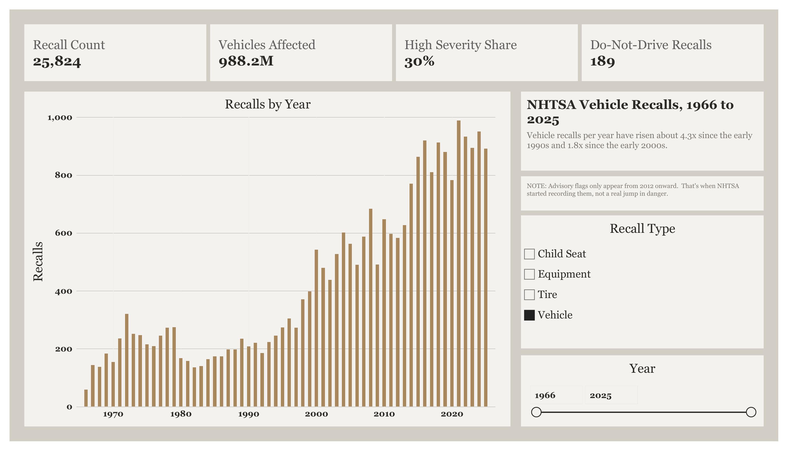
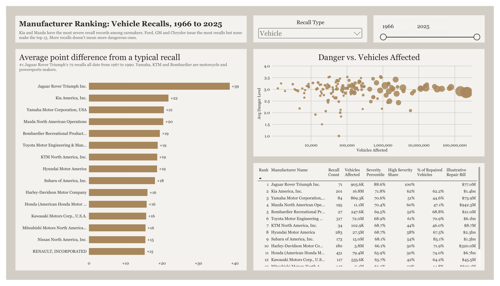

---
# Page title shown at the top of the project page and on the browser tab
title: "Recall Severity by Manufacturer"
# Plain-language question under the title, same pattern as Flight Paths and House Prices
subtitle: "Which vehicle makers have the most dangerous recalls, not just the most recalls?"
# Table of contents on the left so both margins carry something (matches phoenix-nextgen)
toc: true
toc-location: left
---

<!-- ## ADDED BECAUSE the project is still in progress; a Quarto callout box shows this at the top of the page so readers know more is coming. Delete this block when the project is finished. ## -->
::: {.callout-note}
**This project is still in progress.** The dashboard and findings below are complete. The SQL scripts behind the cleanup and severity scoring are being added next.
:::

<!-- Opening paragraph: the question, the data, the tools, in one breath -->

Ford, GM and Chrysler issue more recalls than anyone. That doesn't make their recalls the most dangerous. This project scores every vehicle recall in the National Highway Traffic Safety Administration (NHTSA) database for how serious the defect is, then ranks manufacturers by the typical severity of their recalls instead of the raw count.

Built with **SQL** (PostgreSQL on Supabase) for cleaning and scoring, and **Power BI** (Power Query and DAX) for the dashboard.

<!-- Headline result pulled out as a blockquote, same styling as the flight-noise page -->

> **Kia and Mazda have the most severe recall records among carmakers.** Ford, GM and Chrysler issue the most recalls but none of them make the top 15. More recalls doesn't mean more dangerous ones.

## The dashboard

<!-- Screenshots exported from the Power BI PDF; file names set by the pdftoppm command in the README -->

Downloads: [Power BI file (.pbix)](files/NHTSA_Recall_Severity.pbix) · [Dashboard PDF](files/nhtsa-recalls-dashboard.pdf)

## The data

- **Source:** NHTSA's public recalls flat file, every recall from 1966 to 2025.
- **Size:** 25,824 recalls covering about 988 million vehicles.
- **Structure:** I split the raw file into four linked tables: manufacturers, components, recalls and reports.

## How I built it

### 1. Cleaning up manufacturer names

The same company often appears under several spellings ("Ford Motor Co" vs "Ford Motor Company", or a name with and without "Inc."). If left alone, one manufacturer's recalls get split across several rows and its ranking is wrong.

I found likely duplicates three ways: names that look alike letter by letter, names that only differ by a legal suffix like Inc., LLC or Corp., and names that sit inside another name. A handful of cases needed a judgment call (for example, whether two Daimler entities are really the same company), so I checked how many recalls each merge would move before committing it. Every merge is recorded in a lookup table so it can be audited or undone.

### 2. Scoring how severe each recall is

NHTSA doesn't rate severity, so I built a score from two kinds of evidence:

- **Hard flags NHTSA records:** whether owners were told *Do Not Drive* or *Park Outside* (fire risk), and how many affected vehicles actually got repaired.
- **What the recall says can happen:** each recall has a written consequence summary. I scanned it for keywords and sorted them into tiers, so "fire", "crash" or "loss of steering" counts for more than "label may be missing".

The two are combined in a Severity x Scope grid that gives each recall a danger level. Each manufacturer is then scored by how far its average recall sits above or below a typical recall.

### 3. The dashboard

In Power BI I used Power Query to shape the tables (including custom columns to avoid a circular reference) and wrote DAX measures for the counts, shares and rankings. The ranking page only includes manufacturers with enough recalls for an average to mean something, so one bad recall can't put a small company at the top.

## What I found

<!-- 3 to 5 findings, each one sentence of result plus one of context -->

1. **Kia and Mazda lead the carmakers on severity.** Kia's typical recall sits about 22 points above an average recall and 62% of its recalls are high severity. Mazda is close behind at +20 and 60%.
2. **Volume and severity are different things.** The three companies with the most recalls (Ford, GM, Chrysler) don't appear in the top 15. Honda and Toyota do, which matters because their recalls each cover so many vehicles (79 million and 72 million).
3. **Motorcycle and powersports makers rank high.** Yamaha, Bombardier, KTM, Harley-Davidson and Kawasaki all make the top 15. A defect on a bike is more likely to be described as causing a crash, so this partly reflects the vehicle type.
4. **Repair rates vary a lot.** Subaru got 85% of affected vehicles repaired. Yamaha (45%), Mitsubishi (45%) and Mazda (47%) got fewer than half.
5. **Recalls are far more common than they used to be.** Vehicle recalls per year have risen about 4.3 times since the early 1990s and 1.8 times since the early 2000s.

The top spot, Jaguar Rover Triumph, is a historical case: all of its recalls date from 1967 to 1990, before most of today's safety reporting existed.

## Limitations

- **Advisory flags only exist from 2012 on.** Do Not Drive and Park Outside warnings are zero for every year before 2012, then jump. That's when NHTSA started recording them, not a real jump in danger, so older recalls lean more on the keyword score.
- **Complaints data isn't included.** NHTSA's owner complaints file is the richest source of severity detail (published research has mined it for exactly this), but at about 1.5 GB it wouldn't fit in the free database tier I used.
- **Some recalls have no component listed.** 7,629 recalls in the source data have no component, so they're left out of any component-level breakdown.
- **The repair bill is illustrative.** The "Illustrative Repair Bill" column multiplies vehicles affected by a flat $85 per vehicle. It shows relative scale, not real costs.

## What I'd do next

- Load the complaints file into a database without the 500 MB limit and use it to check the keyword score.
- Compare severity per vehicle sold, not just per recall, using sales data.
- Publish the SQL scripts alongside this page (in progress).
