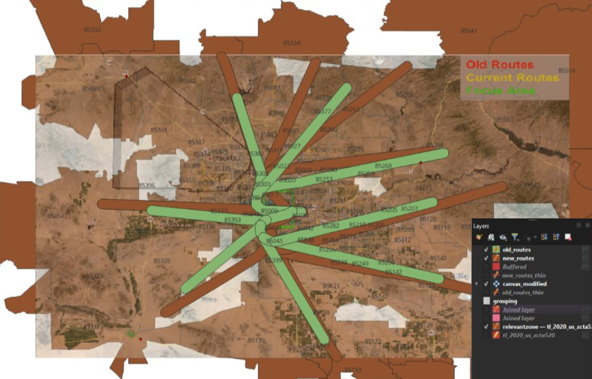
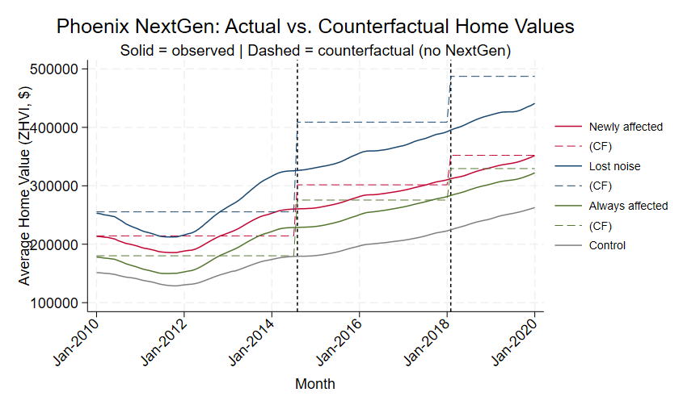
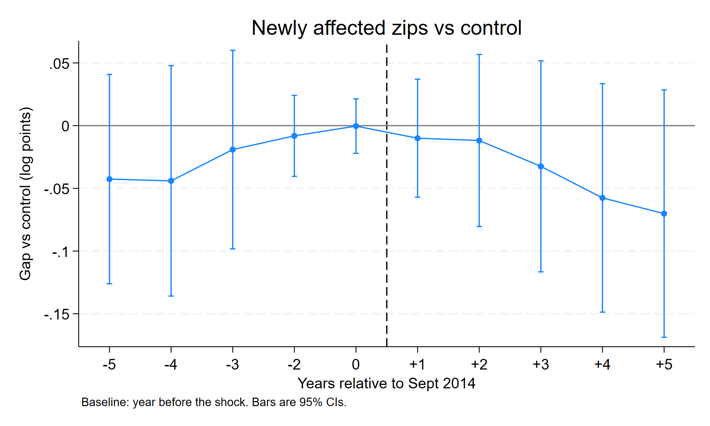

<!-- ============================================================
     SUMMARY
     Front-loaded on purpose. Assume a reader gives this page
     thirty seconds before deciding whether to keep reading.
     ============================================================ -->

## Summary

In September 2014, the FAA rerouted departure paths out of Phoenix Sky Harbor as
part of its NextGen airspace programme. Neighbourhoods that had never had aircraft
overhead suddenly did. Residents sued, and in August 2017 a federal court ordered
the routes reversed.

That sequence is close to a natural experiment: a sharp, unanticipated change in
aircraft noise, applied to some neighbourhoods and not others, and then undone.
I used it to ask whether the affected areas saw home values grow more slowly than
comparable areas nearby.

**The answer is no — not measurably.** Zip codes that gained flight noise show a
cumulative gap of **−6.3%** against the control group by January 2020, but that
estimate cannot be distinguished from zero (95% CI: −18.0% to +5.3%, p = 0.284).

The more interesting finding is methodological. My original college specification
produced a large, highly significant estimate of **+$18,486 per home (p = 0.004)**.
That result does not survive taking logs of the outcome, adding month fixed
effects, or a placebo test on a date when nothing happened. This page presents
both the original analysis and the revision, because the gap between them is the
part I learned the most from.

---

<!-- ============================================================
     BACKGROUND
     ============================================================ -->

## Background

NextGen replaced ground-based radar navigation with satellite-based routing.
One practical consequence is that departure paths become far narrower: instead of
aircraft fanning out across a broad corridor, they follow near-identical tracks.
For anyone living under a new track, that means concentrated, repetitive overflight
noise where there was previously little or none.

The Phoenix rollout is unusually clean for research purposes:

| Date | Event |
|---|---|
| September 2014 | New departure routes go live, with no meaningful public consultation |
| 2014–2017 | City of Phoenix and neighbourhood groups sue the FAA |
| August 2017 | Federal appeals court rules against the FAA and orders routes restored |

Two things make this attractive. First, the change was abrupt rather than phased,
so there is a clear before and after. Second, it was later reversed, which gives a
second shock in the opposite direction — if noise genuinely moves prices, the
effect should unwind.

---

<!-- ============================================================
     DATA
     ============================================================ -->

## Data

**Outcome.** Zillow Home Value Index (ZHVI), all homes, monthly by zip code.
ZHVI is a smoothed estimate of typical home value rather than a transaction
average, so it is not distorted by which particular houses happened to sell in a
given month.

**Panel.** 147 zip codes across Maricopa and Pinal County, monthly from January
2010 to January 2020. 17,749 zip-month observations.

The window deliberately stops before 2020. Anything after that point is
contaminated by the pandemic housing market, which would swamp an effect of this size.

### Defining the four groups

Zip codes were assigned to groups by overlaying the pre-2014 and post-2014 flight
corridors on zip code boundaries in QGIS:

| Group | Planes before 2014 | Planes after 2014 |
|---|---|---|
| Control | No | No |
| Newly affected | No | **Yes** |
| Lost noise | **Yes** | No |
| Always affected | **Yes** | **Yes** |

The four-way split matters more than it might look. "Control" and "always
affected" are genuinely different kinds of place — control zips are suburban areas
planes never flew over, while always-affected zips sit in central Phoenix under a
corridor that predates the policy. Lumping them together as "untreated" would
compare central-city housing to suburban housing and attribute the difference to
aircraft.

---

<!-- ============================================================
     THE ORIGINAL ANALYSIS
     ============================================================ -->

## The original analysis, and what was wrong with it

The version I submitted for the course estimated the model on home values in
dollars, and projected a counterfactual — what the affected zip codes *would* have
been worth had the routes never changed — then read the damage off the gap between
the two lines:

It produced a large, significant number: **+$18,486 per home, p = 0.004**.

Three problems, in order of how much they matter:

**The outcome was in dollars, not logs.** An expensive zip code and a cheap one
respond to the same shock by different dollar amounts but similar percentages.
Estimating in levels lets the expensive zips dominate the result, and the affected
areas were not a random draw from the price distribution.

**There were no month fixed effects.** Without them, the model has no way to absorb
what the Phoenix housing market as a whole was doing in any given month. The period
covers the post-recession recovery, which was steep and uneven across submarkets, so
a lot of what the model attributed to flight paths was really the recovery arriving
at different speeds in different places.

**Nothing tested whether the control group was a valid comparison.** The entire
design rests on the assumption that treated and control zips would have moved
together absent the policy. I asserted it rather than checking it — and as it turns
out, for two of the three groups it is false.

The counterfactual-simulation approach was also a dead end in its own right. It
made the result look precise by drawing a single smooth projected line, when the
honest version of that picture is a wide band of uncertainty.

---

<!-- ============================================================
     REVISED SPECIFICATION
     ============================================================ -->

## The revised specification

All estimates below use log home value as the outcome, with zip code **and** month
fixed effects, and standard errors clustered by zip code.

In plain terms:

- **Log outcome** means coefficients read as percentage changes, so a cheap zip and
  an expensive one contribute on the same scale.
- **Zip fixed effects** absorb everything permanently different about each zip code
  — school quality, distance to downtown, housing stock. The model only uses
  movement *within* a zip code over time.
- **Month fixed effects** absorb whatever was happening market-wide that month, so
  the estimate compares groups against each other in the same month rather than
  against a trend line.
- **Clustering by zip** accounts for the fact that observations from the same zip
  code in consecutive months are not independent pieces of evidence. Without it,
  standard errors are far too small and things look significant when they are not.

Rather than a single before/after step, the model estimates a differential *trend*
for each group, plus a change in that trend after the August 2017 reversal.

### Table 1. Did affected areas grow more slowly?

Annual growth rate relative to control zip codes.

| Group | Sept 2014 – Aug 2017 | After Aug 2017 |
|---|---|---|
| Newly affected | +0.2% | −2.8% |
| Lost noise | +3.9% | −4.0% |
| Always affected | +4.2% | −3.1% |

The first column covers the period when NextGen was in effect; the second covers
the period after the court ordered it reversed. A negative number means that group
grew more slowly than control.

The group that *gained* flight noise shows essentially no difference while the
planes were overhead. And after the reversal, all three groups decline at similar
rates — including the always-affected group, whose exposure never changed at either
date. A shared post-2017 slowdown across groups with completely different noise
histories is not a noise effect. It is something else happening to central Phoenix.

### Table 2. Main specification

Monthly differential trend, log points.

|  | Newly affected | Lost noise | Always affected |
|---|---|---|---|
| Post-shock trend | 0.00020 | 0.00328 | 0.00345\*\*\* |
|  | (0.00171) | (0.00182) | (0.00123) |
| Change after reversal | −0.00255 | −0.00658\*\*\* | −0.00603\*\*\* |
|  | (0.00195) | (0.00206) | (0.00149) |
| Net post-reversal trend | −0.00235\*\*\* | −0.00330\*\*\* | −0.00258\*\*\* |
|  | (0.00064) | (0.00057) | (0.00054) |

Standard errors in parentheses. \*\*\* p&lt;0.01, \*\* p&lt;0.05, \* p&lt;0.10.
Multiply any coefficient by 12 for an annual rate. The net post-reversal trend is
the sum of the two rows above it, computed with `lincom` so that the standard error
accounts for the covariance between the two estimates rather than treating them as
independent.

---

<!-- ============================================================
     VALIDITY — the analytical core of the page
     ============================================================ -->

## Is the control group a valid comparison?

This is the section the original analysis was missing entirely, and it changes the
interpretation of everything above.

### Table 3. Two tests

| Group | Pre-trend test (p) | Placebo shock, Sept 2012 | Verdict |
|---|---|---|---|
| Newly affected | 0.335 | +2.1%/yr (p = 0.413) | Passes both |
| Lost noise | 0.018 | +7.9%/yr (p = 0.003) | Fails both |
| Always affected | 0.003 | +7.9%/yr (p &lt; 0.001) | Fails both |

**The pre-trend test** is a joint F-test that all four pre-treatment event-study
coefficients equal zero. A *high* p-value is the good outcome here: it means the
groups were tracking each other before anything happened, which is what makes them
comparable afterwards.

**The placebo test** runs the identical model against a fake treatment date in
September 2012, using only pre-treatment data. Nothing happened in September 2012.
Any "effect" the model finds is spurious by construction, so it is a direct measure
of how much the design invents from nothing.

Lost-noise and always-affected both produce a large, highly significant effect from
a policy that never happened — roughly twice the size of their estimated
coefficients at the real 2014 shock. Those two groups simply cannot be compared
against the suburban control group. Whatever the model picks up there is
central-Phoenix geography, not aircraft.

Only the newly-affected group survives both checks. It is therefore the only
comparison against control worth interpreting.

### Table 4. The cleanest comparison: lost noise vs always affected

If comparing central Phoenix to the suburbs is the problem, the fix is to compare
central Phoenix to itself. Lost-noise and always-affected zips sat under the *same*
pre-2014 corridor, in the same neighbourhoods and the same submarket. After 2014,
one lost its overflights and the other kept them.

|  | Coefficient | Std. err. | p |
|---|---|---|---|
| Post-shock trend | −0.00017 | 0.00168 | 0.918 |
| Change after reversal | −0.00054 | 0.00174 | 0.755 |

96 zip codes, 11,616 observations.

This comparison holds geography constant, which no comparison against the suburban
control group can. The two groups are statistically indistinguishable in both
periods — a difference of essentially zero, with tight enough standard errors that
a large effect would have shown up.

---

<!-- ============================================================
     EVENT STUDY
     ============================================================ -->

## Event study: newly affected vs control

The tables above compress everything into average trends. The event study instead
traces the gap year by year, which shows *when* any divergence appears — and timing
is what distinguishes a real effect from a coincidence.

### Table 5. Event study coefficients

Cumulative gap relative to the year before the shock, log points.

| Years from Sept 2014 | Coefficient | Std. err. |
|---|---|---|
| −5 | −0.043 | 0.042 |
| −4 | −0.044 | 0.046 |
| −3 | −0.019 | 0.039 |
| −2 | −0.008 | 0.016 |
| −1 | baseline | — |
| 0 | −0.000 | 0.011 |
| +1 | −0.010 | 0.023 |
| +2 | −0.012 | 0.034 |
| +3 | −0.032 | 0.042 |
| +4 | −0.058 | 0.045 |
| +5 | −0.070 | 0.049 |

No coefficient is statistically distinguishable from zero. The pre-treatment values
are flat, which is what validates the design in the first place.

The gap only opens from year +3 onward — that is, from 2017. Which coincides with
the court-ordered *reversal*, not with the 2014 rerouting. A noise effect that
appears three years after the planes arrive, and grows fastest after they leave,
does not fit the story.

---

<!-- ============================================================
     HEADLINE
     ============================================================ -->

## Headline estimate

Cumulative gap for newly-affected zip codes by January 2020:

> **−6.3%** — 95% CI: −18.0% to +5.3%, p = 0.284

The point estimate is negative, but it cannot be distinguished from zero, and the
confidence interval is wide enough to contain effects of the size the hedonic noise
literature typically reports (roughly 0.5–1.0% of home value per decibel).

The honest reading is that this is **a null result driven by limited precision, not
evidence that no effect exists**. With 147 zip codes and a treated group of modest
size, the study cannot rule out a meaningful effect — it can only say it did not
find one.

### What the results show together

Two independent routes reach the same answer:

1. Comparing newly-affected zips against control — the one comparison that survives
   both validity checks — finds no detectable effect, and what movement there is
   arrives three years after the planes did.
2. Comparing lost-noise against always-affected — the comparison that holds
   neighbourhood and submarket constant — finds nothing in either period.

And the large, significant effect from the original specification does not survive
any of the three corrections.

### Robustness

- Re-running with an alternative reversal date of March 2018 leaves the results
  unchanged.
- No zip codes were ambiguous in the QGIS crosswalk, so no judgement calls were
  needed in assigning groups.

---

<!-- ============================================================
     REFLECTION
     ============================================================ -->

## What I would do differently

**Treat exposure as a dose, not a switch.** Every specification here treats a zip
code as either affected or not. In reality a zip code directly under a departure
track experiences something very different from one clipped at the edge, and a
continuous measure of exposure would use that variation instead of throwing it away.
This is the single change most likely to turn an imprecise null into a real estimate.

**Match on pre-period trajectory rather than assuming comparability.** The pre-trend
failures for two of three groups say the control group was chosen badly. Selecting
comparison zips on their pre-2014 price path — rather than on not having planes —
would give a defensible comparison for all three groups instead of one.

**Take the timing seriously.** The gap opening in 2017 rather than 2014 has an
alternative explanation I find plausible: a delayed reaction to the original shock,
as realtors and buyers gradually recognised which areas had become noisier.
Complaint volumes rose year over year through the period, which is consistent with
awareness building slowly rather than arriving with the planes. Testing that would
mean bringing in noise-complaint counts by area and date as a measure of
*perceived* exposure — which is arguably what the housing market actually responds
to.

I have deliberately not gone back to gather that data. The point of revisiting this
project was to fix what was wrong with the inference, not to extend it indefinitely.

---

<!-- ============================================================
     FILES
     Relative paths — these resolve against this page's own folder,
     so they keep working regardless of the site's URL structure.
     ============================================================ -->

## Files

| File | What it is |
|---|---|
| [`original.do`](files/original.do) | The Stata script as submitted for the course |
| [`revised_annotated.do`](files/revised_annotated.do) | The revised analysis, commented throughout |
| [`grouping.csv`](files/grouping.csv) | Zip-code-to-group crosswalk produced in QGIS |

The Zillow ZHVI file is not included here — it is public, frequently updated, and
large. Download "ZHVI All Homes, by ZIP Code" from
[Zillow Research](https://www.zillow.com/research/data/). The repository README has
the full instructions for re-running the analysis.
